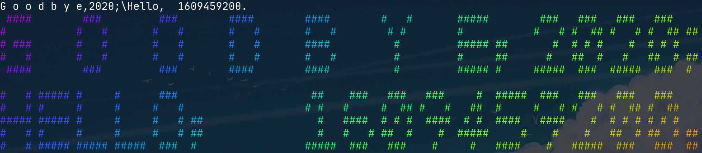
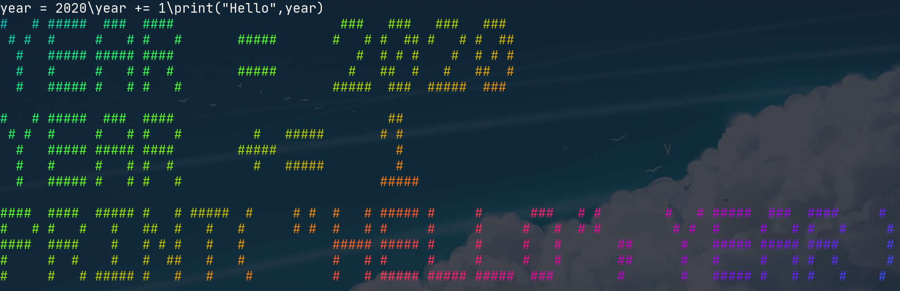
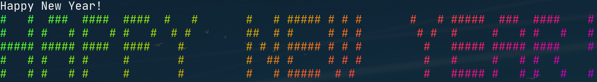

放学后耽搁了一些时间，启程回家后因为道路施工的缘故，也有着相当程度的交通阻塞。在 2020 年的最后一天，我直到晚上七点才终于回到了家里。

伴随着因为网络问题终止的棋局以及终究还是结束了的通话，我又回到了某种孤独的状态。仍未取回行李和眼镜的我，独自检视着这个因为在 /tmp/home 居住时间的加长而慢慢变得陌生的家。

待到洗漱完毕又看了几个时节无关的视频以后，社交媒体上开始响起许多庆祝新年的声音。想着「也许我也该发点什么庆祝一下？」，于是在临近十一点的时候，我开始了对 ChainSay[^1] 的设置。

> 「由于实在想不出来该发什么所以赶紧给 ChainSay 加几个符号顺便（偷懒）搭配 lolcat 看看」（2020-12-31 22:40）

最后所做的事也就基本如上计划所述，添加符号、修改操作方式，色彩方面交给 [lolcat](https://github.com/busyloop/lolcat)，再为了留住 `lolcat -a` 的动画效果使用了 [asciinema](https://asciinema.org) 来录制终端会话，又为了把录制结果转为 GIF 图像编译了 [asciicast2gif](https://github.com/asciinema/asciicast2gif)……

待到 11:50 PM 左右才把这一切搞定，结果尴尬地发现 Mastodon 并不支持上传有着这样分辨率的 GIF 图像！好在还能想起图床这种替代方案，让我最终赶在新年的第一分钟发出了「Happy New Year!」的那张图片。

就这样，东八区的二〇二〇年，结束了。

> 题图摄于 2019 年冬

[^1]: ChainSay 是我在第一段高中经历开始的时候所设想的简单程序，该程序的最初实现应当是在 2018 年秋的假期中。具体效果可见下文图片，不过颜色部分是由 lolcat 完成的。
